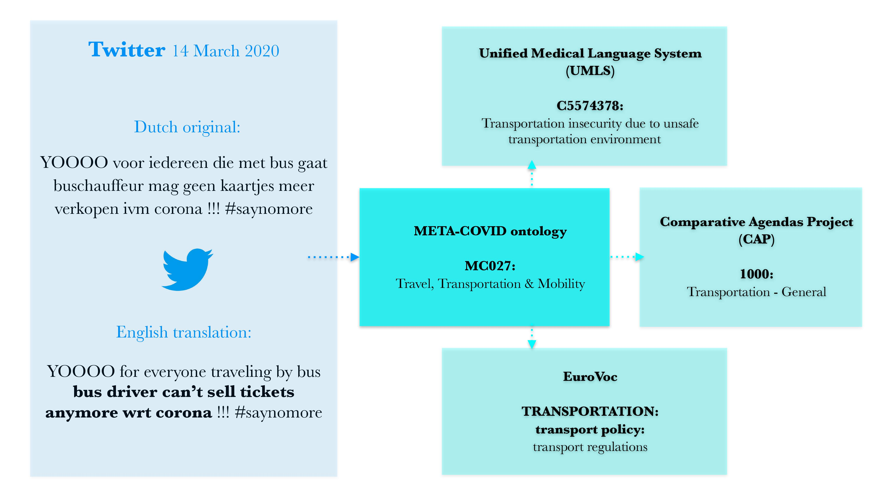

# META-COVID workflow

This directory contains the ontology and workflow of the META-COVID ontology developed within the META-COVID Test Science Project within the EOSC Future project.




## Ontology

The ontology in **metacovid_ontology.owl** was developed using parliamentary data from the [ParlaMint corpus](https://www.clarin.eu/parlamint) and Twitter (now X) data collected in 2020. 

It contains 30 interdisciplinary COVID-relevant topics which link to 203 concepts from different scientific ontologies from the health sciences and social sciences.

You can browse the ontology using our code as follows:

```
from browse_ontology import MetaCovidOntology
metacovid_ontology = MetaCovidOntology(owl_file_path)

# metadata about the linked ontologies
print(metacovid_ontology.get_metadata())

# retrieve the main topics
topics = metacovid_ontology.topics
# gather the topic names and their associated concepts
topic_to_concept = {topic.name: topic.concepts for topic in topics}

# check concepts and their metadata
first_topic_concepts = topics[0].concepts
for concept in first_topic:
    print(concept.name)
    print(concept.metadata)
```


## Workflow

The topics of the META-COVID ontology were used to label parliamentary data from the [ParlaMint corpus](https://www.clarin.eu/parlamint) and Twitter (now X) data collected in 2020. 
The results can be browsed on [this demonstration website](https://metacovid.textua.uantwerpen.be).

While the initial labeling was done with ChatGPT, we've also trained an open-source Dutch RoBERTa model for both parliamentary data and social media data. 
Both the [parliamentary model](https://huggingface.co/PieterFivez/metacovid-parliament) and the [Twitter model](https://huggingface.co/PieterFivez/metacovid-twitter) are hosted on HuggingFace. 

Due to limited training data, we've trained both models for the 5 most frequent topics in the data source, grouping the remaining topics under 'Other'. 
The test results for the parliamentary data and social media data are shown in **test_scores_parliament.txt** and **test_scores_twitter.txt**.


### Workflow: Topic labeling of parliamentary data

```
from transformers import RobertaTokenizer
from demo_workflow import BertForMultiLabelClassification, DemoFunctions
```

```
# Step 1: Loading the parliament model
MODEL_PATH = 'PieterFivez/metacovid-parliament'
model = BertForMultiLabelClassification.from_pretrained(MODEL_PATH)
model.eval()
tokenizer = RobertaTokenizer.from_pretrained("pdelobelle/robbert-v2-dutch-base")
```

```
# Step 2: Demo of the parliament model

Demo = DemoFunctions(model, tokenizer)
# show the available labels
print('Available labels for parliamentary data': Demo.id2label_parliament)

# example parliamentary speech
text = "Mijnheer de minister , op 29 april 2020 , een halve maand geleden dus , verklaarde u tijdens een interview met de RTBF dat de regering aan Defensie de opdracht had gegeven achttien miljoen mondmaskers te bestellen . Vorige week mocht ik in de commissie Legeraankopen van de Staf vernemen op welke manier Defensie die bestelling had aangepakt . Mijnheer de minister , ik moet eerlijk toegeven dat ik er vrij veel vertrouwen in had . Ik had er vertrouwen in dat voor een keer in ons land eens iets efficiënt zou worden aangepakt . Dat was echter buiten de waard of buiten de Belgische Staat gerekend . Blijkbaar is er immers weinig of geen achtergrondcontrole van de potentiële buitenlandse leveranciers gebeurd , waardoor minstens moet worden opgemerkt dat die leveranciers balanstechnisch van bedenkelijke aard zijn ."

# prediction
probabilities = Demo.predict(text)
predicted_labels = Demo.decode_predictions_parliament(probabilities)
```

### Workflow: Topic labeling of Twitter data

```
# Step 1: Loading the Twitter model
MODEL_PATH = 'PieterFivez/metacovid-twitter'
model = BertForMultiLabelClassification.from_pretrained(MODEL_PATH)
model.eval()
tokenizer = RobertaTokenizer.from_pretrained("pdelobelle/robbert-v2-dutch-base")
```

```
# Step 2: Demo of the Twitter model
Demo = DemoFunctions(model, tokenizer)
print('Available labels for Twitter data': Demo.id2label_twitter)

# example tweet
text = "Het grote voordeel van corona is dat alle mensen die niet op planes en airports moeten zijn nu ook lekker wegblijven"

# prediction
probabilities = Demo.predict(text)
predicted_labels = Demo.decode_predictions_twitter(probabilities)
```
